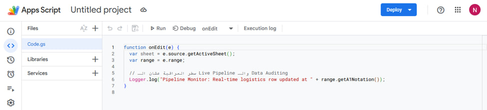
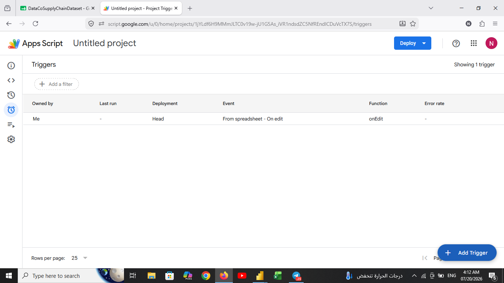
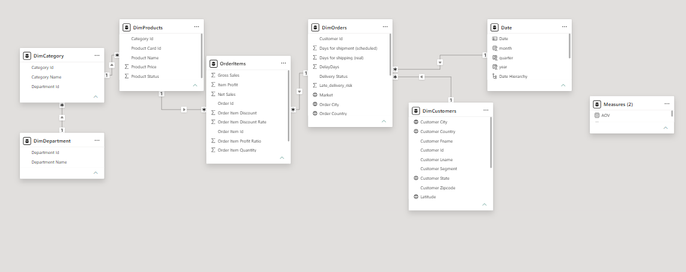
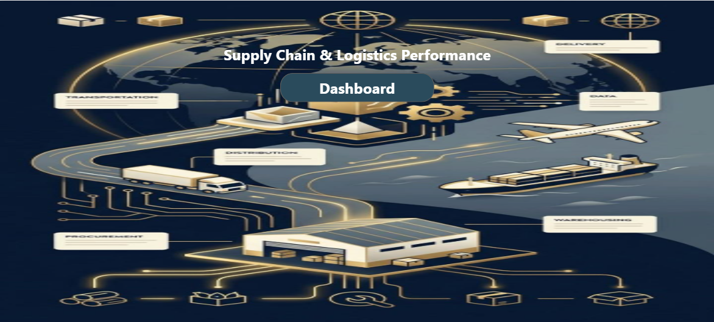
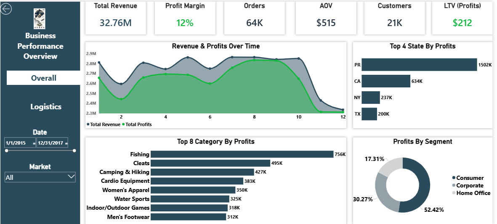
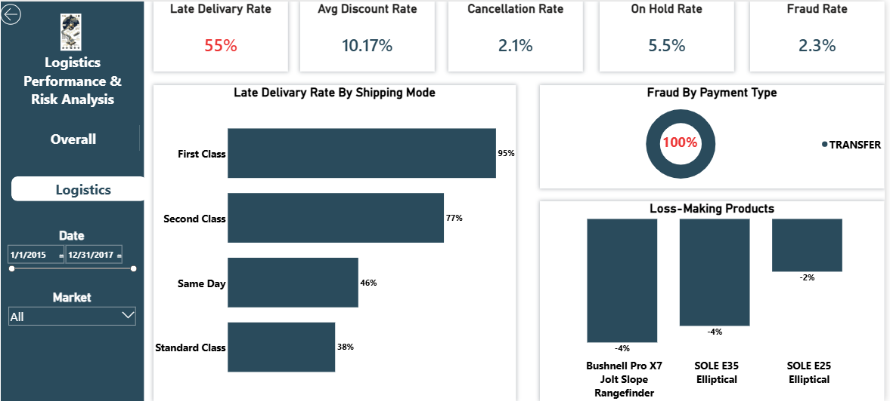

# DataCo Supply Chain Analysis

## Project Overview

This project presents an end-to-end Business Intelligence solution built using Power BI to analyze supply chain operations, logistics performance, customer behavior, and product profitability.

The project covers the complete analytics lifecycle, including:

- Data Collection & Automation
- Data Cleaning
- Data Validation
- Data Modeling
- Snowflake Schema Design
- Feature Engineering
- DAX Measures
- Dashboard Development
- Business Insights & Recommendations

The objective was to transform a large transactional dataset into a scalable analytical model capable of supporting operational and strategic decision-making.

---

## Dataset Information

- Source: DataCo Supply Chain Dataset
- Records: ~180,000
- Columns: 53
- Period Covered: January 2015 – January 2018

The original dataset contained customer, product, department, category, order, and shipping information within a single denormalized table.

---

## Data Collection & Automation

As part of the project, Google Sheets was used to explore cloud-based data collection workflows.

Google Apps Script was implemented and automated using time-driven triggers.

Power BI integration with Google Sheets was tested successfully.

Due to the dataset size (~180K rows), refresh performance became impractical for production analytics. Therefore, the final analytical model was developed using the original dataset source while retaining the automation workflow as a proof of concept.

### Google Apps Script

### Automated Trigger

---

## Data Modeling

The original dataset was transformed into a custom Snowflake Schema designed from scratch.

The schema was manually designed after analyzing business entities, validating relationships, and identifying the appropriate granularity for each business process.

### Model Structure

- OrderItems
- DimOrders
- DimCustomers
- DimProducts
- DimCategory
- DimDepartment
- Date

### Model View

### Snowflake Schema

The final model consists of six business entities and a dedicated Date dimension connected through one-to-many relationships.

This structure reduced redundancy, improved scalability, and enabled flexible analysis across customers, products, categories, departments, orders, and time.

---

## Dashboard Pages

### Dashboard Cover

### Business Performance Overview

#### Key KPIs

- Total Revenue: $32.76M
- Profit Margin: 12%
- Orders: 64K
- AOV: $515
- Customers: 21K
- LTV: $212

### Logistics Performance & Risk Analysis

#### Key Findings

- Late Delivery Rate: 55%
- Fraud Rate: 2.3%
- Cancellation Rate: 2.1%
- On Hold Rate: 5.5%

---

## Major Insights

### Business Insights

- Total revenue exceeded $32 million.
- Consumer customers generated over half of total profits.
- Puerto Rico was the highest profit-generating state.
- A limited number of categories contributed disproportionately to profitability.

### Operational Insights

- 55% of all orders experienced late delivery.
- First Class shipping showed the highest delay rate (95%).
- 100% of fraudulent orders were associated with bank transfer payments.
- Three products consistently generated negative profits due to insufficient margins.

---

## Recommendations

- Investigate operational bottlenecks affecting First Class shipments.
- Implement additional fraud monitoring controls for bank transfer transactions.
- Review pricing strategies for loss-making products.
- Prioritize marketing efforts toward high-profit customer segments.
- Continuously monitor delivery performance KPIs.

---

## Tools & Technologies

- Power BI
- Power Query
- DAX
- Google Sheets
- Google Apps Script
- Snowflake Schema Modeling
- Data Validation
- Business Intelligence
- Supply Chain Analytics

---

## Project Files

- [Power BI Dashboard (.pbix)](DataCoSupplyChainDataset.pbix)
- [Project Documentation (.pdf)](report.pdf)
- [Dataset (.rar)](DataCoSupplyChainDataset.rar)

### Dashboard Screenshots

The repository includes dashboard screenshots, data model diagrams, automation workflow screenshots, and project documentation.
